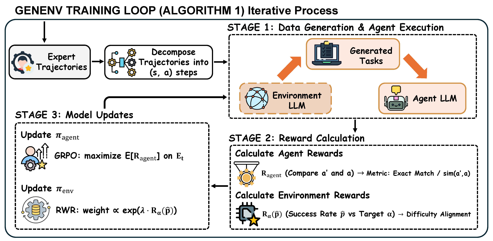

<h1 align="center">GenEnv: Difficulty-Aligned Co-Evolution Between LLM Agents and Environment Simulators</h1>

<p align="center">
  <a href="https://arxiv.org/abs/xxxx.xxxxx"></a>
  <a href="https://github.com/Gen-Verse/GenEnv"></a>
  <a href="https://github.com/volcengine/verl"></a>
  <a href="https://opensource.org/licenses/Apache-2.0"></a>
</p>

---

## 🌟 Introduction

**GenEnv** is a novel co-training framework that simultaneously trains an **Agent LLM** and an **Environment LLM**. The key insight is that the Environment LLM learns to generate training tasks at the *boundary* of the Agent's capability—neither too easy nor too hard—creating an adaptive curriculum that maximizes learning efficiency.

<p align="center">
  
</p>

### Key Features

- 🔄 **Co-Training Loop**: Agent and Environment LLMs are trained alternately, each improving the other
- 📊 **Adaptive Curriculum**: Environment generates tasks calibrated to the Agent's current skill level
- 🎯 **Boundary Learning**: Focus on tasks where the Agent has ~50% success rate for maximum gradient signal
- ⚡ **Built on veRL**: Leverages the efficient [veRL](https://github.com/volcengine/verl) framework for distributed GRPO training

---

## 🚀 Quick Start

### Prerequisites

```bash
# Clone the repository
git clone https://github.com/Gen-Verse/GenEnv.git
cd GenEnv

# Install dependencies
pip install -r requirements.txt
```

### Dependencies

GenEnv is built on top of [veRL](https://github.com/volcengine/verl). Please follow veRL's installation instructions first.

---

## 📋 Usage

### ⚠️ Important: Customization Required

This codebase provides the **training framework** for GenEnv. To use it for your specific task, you need to customize:

1. **Reward Function** (`genenv/utils/reward_functions.py`)
   - Replace `RewardManager.compute_reward()` with your domain-specific reward logic
   - Examples provided for math reasoning, tool calling, and action-based tasks

2. **Environment Prompt Template** (`genenv/trainer/genenv_trainer.py`)
   - Modify `_generate_new_tasks()` to customize how the Env LLM generates new tasks
   - Adjust the prompt template based on your task format

3. **Task Parsing** (`genenv/trainer/genenv_trainer.py`)
   - Update the parsing logic in `_generate_new_tasks()` to extract tasks from Env LLM outputs

4. **Initial Training Data** (`configs/genenv_config.yaml`)
   - Prepare your training data in parquet format with prompts and ground truth answers

### Configuration

Edit `configs/genenv_config.yaml`:

```yaml
# Key paths to customize
env_model_path: /path/to/your/env/model        # Environment LLM
actor_rollout_ref.model.path: /path/to/agent   # Agent LLM
data.train_files: /path/to/train.parquet       # Training data
data.val_files: /path/to/val.parquet           # Validation data
trainer.default_local_dir: /path/to/checkpoints

# GenEnv specific parameters
genenv:
  enable: True
  filtering_k: 0.1           # Filter top/bottom 10% of prompts
  num_generations_per_prompt: 4
```

### Training

```bash
# Using the provided script
bash scripts/run_genenv.sh --model /path/to/model --env-model /path/to/env/model

# Or directly with Python
python -m genenv.train \
    genenv.enable=True \
    env_model_path=/path/to/env/model \
    actor_rollout_ref.model.path=/path/to/agent \
    data.train_files=/path/to/train.parquet \
    data.val_files=/path/to/val.parquet
```

---

## 📁 Project Structure

```
GenEnv/
├── genenv/
│   ├── __init__.py
│   ├── train.py                    # Main training entry point
│   ├── trainer/
│   │   ├── __init__.py
│   │   └── genenv_trainer.py       # Core GenEnv training loop
│   └── utils/
│       ├── __init__.py
│       └── reward_functions.py     # Reward function implementations
├── configs/
│   └── genenv_config.yaml          # Training configuration
├── scripts/
│   └── run_genenv.sh               # Training launch script
├── requirements.txt
└── README.md
```

---

## 🔧 Reward Function Examples

### Math Reasoning (Default)

```python
def compute_reward(self, generated_text: str, ground_truth: Any) -> float:
    pred_answer = self._extract_boxed_answer(generated_text)
    gold_answer = self._get_gold_answer(ground_truth)
    return 1.0 if pred_answer == gold_answer else 0.0
```

### Tool Calling

```python
from genenv.utils import ToolCallingRewardManager

reward_fn = ToolCallingRewardManager(tokenizer=tokenizer)
# Checks if <tool_call>{"name": ..., "parameters": ...}</tool_call> matches ground truth
```

### Custom Domain

```python
class MyRewardManager(RewardManager):
    def compute_reward(self, generated_text: str, ground_truth: Any) -> float:
        # Your custom reward logic here
        return score
```

---

## 📊 Training Data Format

Your training data should be in parquet format with at least these columns:

| Column | Description |
|--------|-------------|
| `prompt` | The task prompt (can be string or list of chat messages) |
| `reward_model` | Dict containing `{"ground_truth": <answer>}` |

Example:
```python
import pandas as pd

data = [
    {
        "prompt": [{"role": "user", "content": "What is 2 + 2?"}],
        "reward_model": {"ground_truth": "4"}
    },
    # ... more examples
]
pd.DataFrame(data).to_parquet("train.parquet")
```

---

## 🙏 Acknowledgements

This project is built upon the excellent work of:

- **[veRL](https://github.com/volcengine/verl)** - Volcano Engine Reinforcement Learning for LLMs
- **[vLLM](https://github.com/vllm-project/vllm)** - High-throughput LLM serving

We thank the authors for making their code publicly available.

---

## 📄 License

This project is licensed under the Apache License 2.0 - see the [LICENSE](LICENSE) file for details.

---

## 📖 Citation

If you find GenEnv useful for your research, please consider citing:

```bibtex
@article{genenv2025,
  title={GenEnv: Generative Environment Co-Training for LLM Agents},
  author={},
  journal={arXiv preprint arXiv:xxxx.xxxxx},
  year={2025}
}
```

---

<p align="center">
  <b>Princeton AI Lab</b> | <a href="https://github.com/Gen-Verse">Gen-Verse</a>
</p>
